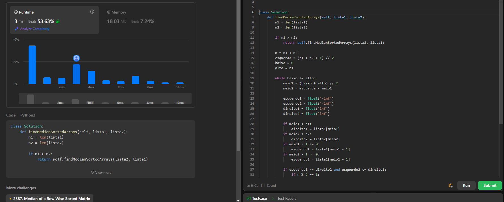
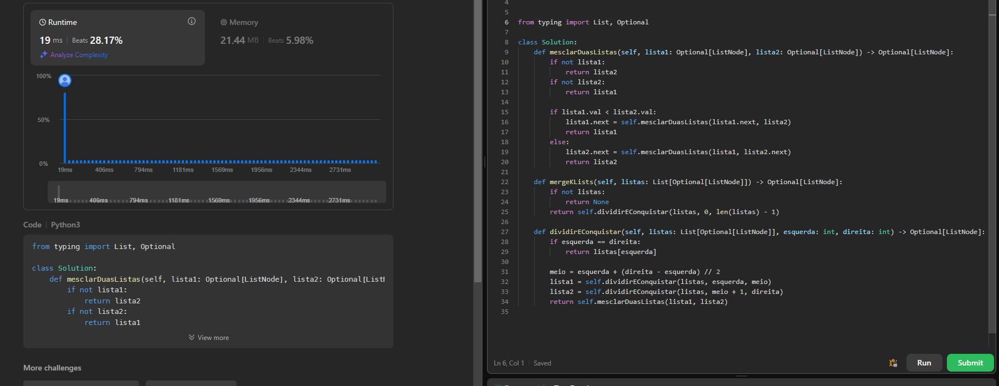
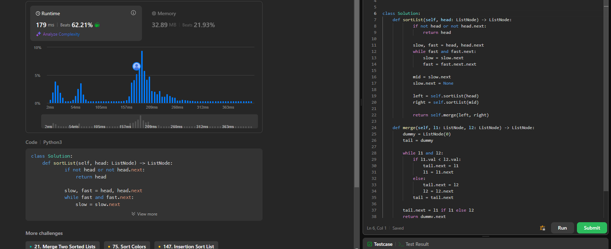

Temas:
  Link para o video: https://youtu.be/-pUAqK8PErA
# NomedoProjeto

**Conteúdo da Disciplina**: Dividir e Conquistar 

## Alunos
|Matrícula | Aluno |
| -- | -- |
| 19/0039116 |  Vinicius Alves Freitas Livramento |

## Questões 

|Questão | Nível |
| -- | -- |
| [4. Median of Two Sorted Arrays](https://leetcode.com/problems/median-of-two-sorted-arrays/description/?envType=problem-list-v2&envId=divide-and-conquer)  |  Difícil |
| [23. Merge k Sorted Lists](https://leetcode.com/problems/merge-k-sorted-lists/description/?envType=problem-list-v2&envId=divide-and-conquer)  |  Difícil |
| [148. Sort List](https://leetcode.com/problems/sort-list/description/?envType=problem-list-v2&envId=divide-and-conquer) |  Médio |

## Sobre 
Realização de exercícios da plataforma de juiz eletrônico LeetCode

## Screenshots
### Problema 4

### Problema 23

## Problema 148

## Instalação 
**Linguagem**: Python 
